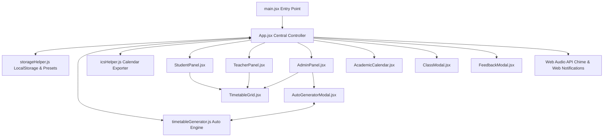

# MCA Time Table & Notification Provider (LecAlert)

## 📌 Project Overview (प्रोजेक्ट विवरण)

**MCA Time Table Notification Provider** (जिसे **LecAlert** भी कहा जाता है) एक अत्याधुनिक, रिस्पॉन्सिव वेब एप्लीकेशन है जो MCA छात्रों, शिक्षकों और एडमिन के लिए टाइमटेबल मैनेजमेंट, रीयल-टाइम लेक्चर नोटिफिकेशन, ऑटोमैटिक टाइमटेबल जनरेशन और अकादमिक कैलेंडर मैनेजमेंट प्रदान करता है।

---

## 🛠️ Tech Stack & Technologies Used (प्रयुक्त तकनीकें)

1. **Frontend Core**: React 19 (JSX)
2. **Build Tool & Dev Server**: Vite 8
3. **Icons & UI Elements**: Lucide React (`lucide-react`)
4. **Styling & Design System**: Modern CSS3 (CSS Variables, Glassmorphism, Responsive Grid/Flexbox, Dynamic Dark/Light/Coffee/Vokka Themes)
5. **Code Linting**: Oxlint
6. **State & Storage Persistence**: Web LocalStorage API
7. **Audio Engine**: Web Audio API Synthesizer (Zero-external audio file dependency)
8. **Calendar Integration**: iCalendar (.ics) format generator
9. **Security**: SHA-256 Cryptographic Hash (Web Crypto API) for Admin authentication

---

## 📁 Directory & File Structure (फाइल संरचना)

```text
Time-Table-/
├── index.html                  # HTML5 Entry point
├── package.json                # Dependencies and npm scripts
├── vite.config.js              # Vite configuration
├── README.md                   # Complete Documentation (यह फाइल)
└── src/
    ├── main.jsx                # React App Root Entry Point
    ├── App.jsx                 # Central App Controller & Global State Provider
    ├── index.css               # Global Theme Tokens, Layout Styles & CSS Variables
    ├── App.css                 # Component Level Tweaks & Animations
    ├── components/
    │   ├── StudentPanel.jsx    # Student Portal View (Live lecture countdown, schedule, preset selector)
    │   ├── TeacherPanel.jsx    # Teacher Portal View (Personal schedule, Proxy/Substitute management)
    │   ├── AdminPanel.jsx      # Admin Control Center (Settings, Presets, Reset, Security, Backup)
    │   ├── TimetableGrid.jsx   # Interactive Weekly Schedule Grid (Days vs Time Slots)
    │   ├── AcademicCalendar.jsx# Academic Events, Exams, Deadlines & Holidays Tracker
    │   ├── ClassModal.jsx      # Add / Edit Lecture Form Modal
    │   ├── AutoGeneratorModal.jsx # AI Conflict-Free Timetable Generator Interface
    │   ├── FeedbackModal.jsx   # User Feedback & Bug Reporting Modal
    │   ├── SettingsPanel.jsx   # Settings Configuration & Web Audio Chime Synthesizer
    │   └── Dashboard.jsx       # Quick Stats & Dashboard Widgets
    └── utils/
        ├── storageHelper.js    # LocalStorage Manager, Default Presets (A/B/C) & Share URL Encoder
        ├── timetableGenerator.js # Algorithmic Constraint-based Conflict-Free Timetable Engine
        └── icsHelper.js        # iCalendar (.ics) Exporter for Google/Apple Calendars
```

---

## 🧩 Comprehensive Module Breakdown (हर मॉड्यूल क्या काम करता है, कैसे काम करता है और कहाँ काम करता है)

| मॉड्यूल (Module Name) | कहाँ स्थित है (File Location) | क्या काम करता है (What it does) | कैसे काम करता है (How it works) |
| :--- | :--- | :--- | :--- |
| **`main.jsx`** | `src/main.jsx` | एप्लिकेशन का एंट्री पॉइंट है। | HTML के `#root` DIV में React DOM `createRoot` की मदद से `<App />` कॉम्पोनेंट को रेंडर करता है। |
| **`App.jsx`** | `src/App.jsx` | पूरे प्रोजेक्ट का सेंट्रल कंट्रोलर (Brain) है। | सभी ग्लोबल स्टेट्स (Timetable, Settings, Themes, Active Portals, Modals) को कंट्रोल करता है। 1-सेकंड की टाइमर लूप चलाकर नोटिफिकेशन ट्रिगर करता है। |
| **`StudentPanel.jsx`** | `src/components/StudentPanel.jsx` | छात्रों के लिए मुख्य व्यू (Student Portal) प्रदान करता है। | वर्तमान चल रहे लेक्चर, अगले लेक्चर का काउंटडाउन टाइमर, सेक्शन A/B/C प्रिसेट सेलेक्टर, सर्च फ़िल्टर और `.ics` एक्सपोर्ट बटन दिखाता है। |
| **`TeacherPanel.jsx`** | `src/components/TeacherPanel.jsx` | शिक्षकों के लिए पर्सनल पोर्टल प्रदान करता है। | शिक्षक नाम से फ़िल्टर करके उनका वीकली शेड्यूल दिखाता है और किसी अन्य शिक्षक को प्रॉक्सी/सब्स्टिट्यूट असाइन करने की सुविधा देता है। |
| **`AdminPanel.jsx`** | `src/components/AdminPanel.jsx` | एडमिन कंट्रोल सेंटर प्रदान करता है। | SHA-256 पासकोड से सुरक्षित है। यहाँ से एडमिन अलार्म टाइमिंग बदल सकते हैं, प्रिसेट लोड कर सकते हैं, टाइमटेबल जनरेट कर सकते हैं या बैकअप/रिसेट कर सकते हैं। |
| **`TimetableGrid.jsx`** | `src/components/TimetableGrid.jsx` | साप्ताहिक टाइमटेबल ग्रिड व्यू प्रदान करता है। | सोमवार से शनिवार के स्लॉट्स को 2D टेबल/ग्रिड में कलर-कोडेड कार्ड्स के रूप में दिखाता है। एडमिन यहाँ से डायरेक्ट एडिट/डिलीट भी कर सकते हैं। |
| **`AcademicCalendar.jsx`**| `src/components/AcademicCalendar.jsx` | कॉलेज अकादमिक कैलेंडर दिखाता है। | परीक्षाएं (Exams), असाइनमेंट डेडलाइन्स, और छुट्टियों को काउंटडाउन बैज और फ़िल्टर के साथ दिखाता है। एडमिन इवेंट्स जोड़/हटा सकते हैं। |
| **`ClassModal.jsx`** | `src/components/ClassModal.jsx` | लेक्चर जोड़ने या एडिट करने का पॉपअप फॉर्म। | जब एडमिन Add/Edit पर क्लिक करता है, तो विषय नाम, शिक्षक, रूम नंबर, समय, दिन और कलर चुनने का इनपुट फॉर्म खोलता है। |
| **`AutoGeneratorModal.jsx`**| `src/components/AutoGeneratorModal.jsx` | ऑटोमैटिक टाइमटेबल जनरेटर का UI। | शिक्षकों के वर्कलोड और घंटों के आधार पर बिना किसी स्लॉट क्लैश के टाइमटेबल जनरेट करने का बटन और व्यू देता है। |
| **`FeedbackModal.jsx`** | `src/components/FeedbackModal.jsx` | फीडबैक और सपोर्ट फ़ॉर्म। | छात्रों और शिक्षकों को बग रिपोर्ट या फ़ीचर रिक्वेस्ट भेजने का पॉपअप देता है। |
| **`SettingsPanel.jsx`** | `src/components/SettingsPanel.jsx` | अलार्म साउंड सिंथेसाइज़र और सेटिंग्स कंट्रोलर। | Web Audio API (`AudioContext`) का उपयोग करके बिना किसी बाहरी MP3 फाइल के रियल टाइम में साउंड चाइम (Chime Sound) तैयार करता है। |
| **`storageHelper.js`** | `src/utils/storageHelper.js` | डेटा सेविंग और URL शेयरिंग हेल्पर। | `localStorage` में डेटा सेव/लोड करता है, MCA Section A, B, C का डिफॉल्ट डेटा प्रदान करता है और टाइमटेबल को Compress करके Shareable URL Hash बनाता है। |
| **`timetableGenerator.js`**| `src/utils/timetableGenerator.js` | एल्गोरिथमिक टाइमटेबल जनरेटर इंजन। | Teacher, Section, और Room availability के कॉन्फ्लिक्ट्स को चेक करके स्वचालित रूप से 100% टकराव-मुक्त टाइमटेबल बनाता है। |
| **`icsHelper.js`** | `src/utils/icsHelper.js` | iCalendar (.ics) फाइल क्रिएटर। | टाइमटेबल डेटा को स्टैंडर्ड `.ics` कैलेंडर फॉर्मेट में बदलकर Google Calendar या Phone Calendar में डाउनलोड करवाता है। |

---

## 🔗 System Interconnections & Linkages (कौन सा सेक्शन दूसरे से कैसे अटैच है और कैसा लिंक है)

यह एप्लिकेशन **Uni-directional Data Flow** और **Centralized State Control** पैटर्न का पालन करता है:



### 1. `App.jsx` ↔ `storageHelper.js` का लिंक
- **कैसे अटैच है**: जब एप्लीकेशन लोड होता है (`useEffect`), `App.jsx` `storageHelper.js` के `loadTimetable()`, `loadSettings()`, और `loadAcademicCalendar()` फ़ंक्शंस को कॉल करके डेटा उठाता है।
- **डेटा फ्लो**: जब भी छात्र या एडमिन टाइमटेबल में कोई बदलाव करता है, `App.jsx` तुरंत `storageHelper.js` के माध्यम से ब्राउजर के `localStorage` में नया डेटा अपडेट कर देता है।

### 2. Real-time Alarm Loop ↔ Web Audio API का लिंक
- **कैसे अटैच है**: `App.jsx` में हर 1 सेकंड में `setInterval` लूप चलता है।
- **डेटा फ्लो**: यह लूप वर्तमान समय (घंटे और मिनट) की तुलना प्रत्येक लेक्चर के `startTime - preTime` से करता है। जैसे ही लेक्चर शुरू होने में 5 मिनट (या तय समय) बाकी होते हैं, `App.jsx` `SettingsPanel.jsx` के `playSyntheticChime()` फ़ंक्शन को ट्रिगर करता है जो बिना किसी external sound file के सीधे कंप्यूटर के स्पीकर पर चाइम प्ले करता है।

### 3. Admin Security & SHA-256 Hashing का लिंक
- **कैसे अटैच है**: जब भी कोई यूज़र किसी क्लास को ऐड (`ClassModal`), एडिट, डिलीट, या रिसेट करता है, `App.jsx` का `verifyAdminAction()` फ़ंक्शन कॉल होता है।
- **डेटा फ्लो**: यह यूज़र से पासकोड मांगता है और Web Crypto API (`crypto.subtle.digest('SHA-256')`) के ज़रिए इनपुट पासवर्ड को हैश करता है। हैश मैच होने पर ही बदलाव की अनुमति मिलती है।

### 4. `AutoGeneratorModal.jsx` ↔ `timetableGenerator.js` का लिंक
- **कैसे अटैच है**: एडमिन पैनल से "Auto Generate" पर क्लिक करने पर `AutoGeneratorModal` खुलता है।
- **डेटा फ्लो**: जब एडमिन शिक्षकों का वर्कलोड सेट करके "Generate" दबाता है, तो यह `timetableGenerator.js` के `generateConflictFreeTimetable()` एल्गोरिदम को चलाता है। यह एल्गोरिदम तीन सेट्स (`teacherBookings`, `sectionBookings`, `roomBookings`) का इस्तेमाल करके ज़ीरो क्लैश वाला टाइमटेबल जनरेट करके `App.jsx` को वापस भेज देता है।

### 5. `StudentPanel.jsx` / `TeacherPanel.jsx` ↔ `icsHelper.js` का लिंक
- **कैसे अटैच है**: दोनों पोर्टल्स में "Export to Calendar (.ics)" का बटन होता है।
- **डेटा फ्लो**: इस पर क्लिक करने पर वर्तमान टाइमटेबल की एरे `icsHelper.js` के `downloadICSFile()` फ़ंक्शन में भेजी जाती है। यह फ़ंक्शन सभी क्लासेज को 5-मिनट प्री-अलार्म के साथ `.ics` स्ट्रिंग बनाकर ब्राउज़र से ऑटो-डाउनलोड करवा देता है।

### 6. `TeacherPanel.jsx` ↔ Proxy Notification Engine
- **कैसे अटैच है**: शिक्षक यदि अनुपस्थित होने वाले हैं, तो वे अपनी क्लास किसी दूसरे शिक्षक को प्रॉक्सी के रूप में असाइन कर सकते हैं।
- **डेटा फ्लो**: `TeacherPanel` `storageHelper.js` के `addProxyNotification()` को कॉल करके प्रॉक्सी नोटिफिकेशन सेव करता है, जो दूसरे शिक्षक के लॉगिन/व्यू में अलर्ट के रूप में दिखता है।

---

## ⚡ Step-by-Step Working Mechanism (स्टेप-बाय-स्टेप एप्लीकेशन कैसे काम करता है)

1. **Step 1: Application Bootstrapping (शुरुआत)**
   - यूज़र जब `index.html` खोलता है, तो `main.jsx` लोड होता है और React root माउंट करता है।
   - `App.jsx` निष्पादित होता है और `localStorage` सेMCA Section A, B या C का टाइमटेबल डेटा तथा यूज़र प्रेफरेंसेस (Theme, Sounds, Alert mins) लोड करता है।

2. **Step 2: URL Hash Share Inspection**
   - यदि यूज़र किसी के द्वारा भेजे गए शेयर लिंक (`#share=...`) से आया है, तो `App.jsx` `parseShareUrl()` चलाकर कॉम्प्रेस्ड डेटा को डिकोड करता है और यूज़र को टाइमटेबल "Merge" या "Replace" करने का विकल्प दिखाता है।

3. **Step 3: Portal Navigation & Live View**
   - यूज़र Header से तीन में से कोई भी पोर्टल चुन सकता है:
     - **Student Portal**: इसमें Live Lecture Card चमकता है जिसमें चल रही क्लास या आने वाली क्लास का रीयल-टाइम काउंटडाउन चलता है।
     - **Teacher Portal**: शिक्षक अपना नाम चुनकर अपने हफ़्ते का शेड्यूल देख सकते हैं और प्रॉक्सी भेज/प्राप्त कर सकते हैं।
     - **Admin Portal**: एडमिन पासकोड डालकर टाइमटेबल स्ट्रक्चर, सेटिंग्स, थीम्स, और बल्क ऑपरेशन्स कर सकते हैं।

4. **Step 4: Continuous Alert Monitoring (रीयल-टाइम अलार्म)**
   - बैकग्राउंड में हर सेकंड समय की जाँच होती है। क्लास शुरू होने से ठीक `preTime` मिनट पहले ब्राउज़र नोटिफिकेशन पॉपअप आता है और चाइम साउंड बजता है।

5. **Step 5: Calendar Syncing & Exporting**
   - छात्र "Export to Calendar" पर क्लिक करके अपनी पूरी समय-सारणी को अपने मोबाइल या गूगल कैलेंडर से सिंक कर सकते हैं।

---

## 🚀 Building & Running Locally (प्रोजेक्ट चलाने की विधि)

### 1. प्रिरिक्विजिट्स (Prerequisites)
- [Node.js](https://nodejs.org/) (v18.0.0 या उससे नया)

### 2. कमांड्स (Commands)

```bash
# Dependencies इनस्टॉल करें
npm install

# डेवलपमेंट सर्वर स्टार्ट करें
npm run dev

# प्रोडक्शन बिल्ड तैयार करें
npm run build

# कोड क्वालिटी जांचें (Linter)
npm run lint
```

---

## 📄 License & Credits
© 2026 **MCA Time Table & Notification Provider** • Developed with ❤️ by **Cheenu Sagar**.